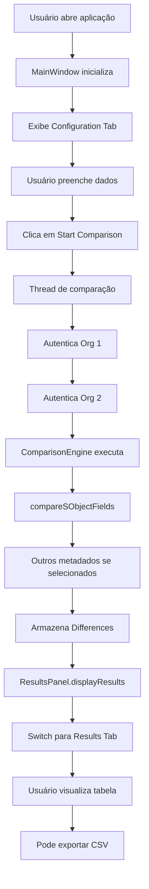

# Documentação Técnica - Salesforce Org Comparator

## 📋 Status de Implementação

### ✅ IMPLEMENTADO

#### Core Functionality
- [x] Interface Swing com formulários amigáveis
- [x] Autenticação OAuth2 (Username/Password + Security Token)
- [x] Conexão com Salesforce REST API v59.0
- [x] Comparação de campos SObject
  - Verifica nomes de campos
  - Verifica tipos de dados (Field Type)
  - Detecta campos faltando em uma Org
  - Detecta inconsistências de tipo
- [x] Exibição de resultados em tabela formatada
- [x] Exportação em CSV
- [x] Build script automático (JAR executável)

#### UI/UX
- [x] Tab "Configuration" para entrada de dados
- [x] Tab "Results" para visualização de resultados
- [x] Checkboxes para seleção de metadados
- [x] Status visual (OK/Erro)
- [x] Botões de controle (Comparar, Exportar, Limpar)
- [x] Validação básica de entrada

---

### ⏳ PLANEJADO (MVP+)

#### Comparação de Metadados (Estrutura criada, implementação em `TODO`)
- [ ] Page Layouts
- [ ] Validation Rules
- [ ] Flows (Record Triggered)
- [ ] Apex Triggers
- [ ] Custom Metadata
- [ ] Custom Settings
- [ ] Permission Sets
- [ ] Profiles
- [ ] Groups
- [ ] Approval Processes
- [ ] Named Credentials

#### Recursos Adicionais
- [ ] Persistência de configurações (Settings File)
- [ ] Load/Save Settings do usuário
- [ ] Histórico de comparações
- [ ] Diferenças visuais (highlight)
- [ ] Interface Web (versão online)
- [ ] Sincronização automática
- [ ] Notificações (Email/Slack)
- [ ] Integração com versionamento Git

---

## 🏗️ Arquitetura

```
SalesforceComparator/
├── src/main/java/com/sfcomparator/
│   ├── model/
│   │   ├── OrgConnection.java          # Dados de conexão
│   │   ├── ComparisonConfig.java       # Configurações de comparação
│   │   ├── Difference.java             # Modelo de divergência
│   │   └── Field.java                  # Modelo de campo SObject
│   │
│   ├── api/
│   │   └── SalesforceAPIClient.java    # Cliente HTTP para Salesforce
│   │
│   ├── comparator/
│   │   └── ComparisonEngine.java       # Engine principal de comparação
│   │
│   └── ui/
│       ├── MainWindow.java             # Janela principal
│       ├── OrgConnectionPanel.java     # Formulário de conexão
│       ├── ComparisonConfigPanel.java  # Formulário de config
│       └── ResultsPanel.java           # Tabela de resultados
│
├── lib/
│   └── json-20231013.jar              # Dependência JSON
│
├── build/                              # Arquivos compilados
├── dist/                               # JAR final
├── build.bat                           # Build script Windows
├── build.sh                            # Build script Linux/Mac
└── run.bat                             # Run script Windows
```

---

## 🔄 Fluxo de Execução



---

## 🔐 Fluxo de Autenticação

```
1. OrgConnection recebe credenciais do usuário
2. SalesforceAPIClient.authenticate()
   - POST /services/oauth2/token
   - Recebe access_token
3. Armazena token em OrgConnection.accessToken
4. Todas requisições subsequentes usam Authorization: Bearer <token>
5. Token expira após 24h (reautenticação automática se necessário)
```

---

## 🎯 API Endpoints Utilizados

### Autenticação
```
POST /services/oauth2/token
Body: grant_type=password&client_id=...&client_secret=...&username=...&password=...
```

### Describe SObject
```
GET /services/data/v59.0/sobjects/{SObjectName}/describe
Headers: Authorization: Bearer <access_token>
Response: {
  "name": "Account",
  "fields": [
    { "name": "Id", "type": "id" },
    { "name": "Name", "type": "string" },
    ...
  ]
}
```

### Query Records
```
GET /services/data/v59.0/query?q=SELECT+ID+FROM+Account+LIMIT+100
Headers: Authorization: Bearer <access_token>
```

---

## 📊 Modelo de Dados - Difference

```java
public enum DifferenceType {
    SOBJECT_FIELD_MISSING_IN_ORG2,
    SOBJECT_FIELD_MISSING_IN_ORG1,
    SOBJECT_FIELD_TYPE_MISMATCH,
    METADATA_MISSING_IN_ORG2,
    METADATA_MISSING_IN_ORG1,
    METADATA_STRUCTURE_MISMATCH
}

public class Difference {
    private DifferenceType type;
    private String category;        // "SObject", "Apex Class", "Flow"
    private String name;            // "Account.Email__c"
    private String org1Value;       // "Text"
    private String org2Value;       // "MISSING"
    private String details;         // Descrição detalhada
}
```

---

## 🔧 Como Implementar Novos Metadados

### Exemplo: Implementar Validation Rules

1. **Adicione método em `SalesforceAPIClient`:**
```java
public JSONArray getValidationRules(String sobjectName) throws Exception {
    String url = connection.getInstanceUrl() + 
        "/services/data/v59.0/query?q=SELECT+Id,ApiName,Active+FROM+ValidationRule+WHERE+EntityDefinition.QualifiedApiName='" + 
        sobjectName + "'";
    return executeSOQL(url);
}
```

2. **Adicione método em `ComparisonEngine`:**
```java
private void compareValidationRules() throws Exception {
    JSONArray org1Rules = org1Client.getValidationRules(config.getSobjectName());
    JSONArray org2Rules = org2Client.getValidationRules(config.getSobjectName());
    
    // Compare org1Rules e org2Rules
    // Adicione Difference objects à lista
}
```

3. **Implemente lógica de comparação:**
```java
Map<String, JSONObject> org1Map = new HashMap<>();
for (int i = 0; i < org1Rules.length(); i++) {
    JSONObject rule = org1Rules.getJSONObject(i);
    org1Map.put(rule.getString("ApiName"), rule);
}

// Idem para org2

// Verificar divergências
for (String ruleName : org1Map.keySet()) {
    if (!org2Map.containsKey(ruleName)) {
        Difference diff = new Difference(
            Difference.DifferenceType.METADATA_MISSING_IN_ORG2,
            "Validation Rule",
            ruleName,
            org1Map.get(ruleName).getString("Active"),
            "MISSING"
        );
        differences.add(diff);
    }
}
```

---

## 🏆 Boas Práticas de Codificação

### 1. Tratamento de Erros
- Sempre adicione try-catch apropriados
- Forneça mensagens de erro úteis ao usuário
- Log em console para debug

### 2. Performance
- Use HashMap para lookups O(1)
- Evite loops aninhados quando possível
- Cache resultados de API

### 3. Threading
- Comparação ocorre em thread separada (não bloqueia UI)
- Use `SwingUtilities.invokeLater()` para atualizar UI

### 4. Segurança
- Nunca armazene senhas em disco
- Use HTTPS sempre
- Valide entrada do usuário

---

## 🧪 Testando a Aplicação

### Teste 1: Autenticação Básica
```
1. Preencha credenciais válidas
2. Clique Start Comparison
3. Verifique se conecta sem erro
4. Se houver erro, a mensagem deve ser clara
```

### Teste 2: Comparação de Campos
```
1. Use objeto SObject padrão (Account)
2. Execute comparação
3. Verifique se detecta campos
4. Crie um campo em Org 1, execute novamente
5. Deve aparecer como divergência
```

### Teste 3: Exportação CSV
```
1. Execute comparação com divergências
2. Clique Export to CSV
3. Abra arquivo em Excel
4. Verifique formatação e dados
```

---

## 🚀 Próximos Passos

### Fase 1: MVP Completo
- [ ] Completar comparação de todos metadados
- [ ] Testes com dados reais
- [ ] Documentação de usuário completa

### Fase 2: Funcionalidades
- [ ] Persistência de configurações
- [ ] Histórico de comparações
- [ ] Relatórios em PDF

### Fase 3: Escalabilidade
- [ ] Interface Web
- [ ] API Backend
- [ ] Banco de dados para histórico

### Fase 4: Integração
- [ ] CI/CD (Jenkins, GitHub Actions)
- [ ] Notificações (Slack, Email)
- [ ] Git integration

---

## 📚 Referências

- [Salesforce REST API](https://developer.salesforce.com/docs/atlas.en-us.api_rest.meta/api_rest/)
- [Describe SObject](https://developer.salesforce.com/docs/atlas.en-us.api_rest.meta/api_rest/resources_sobject_describe.htm)
- [Java HttpClient](https://docs.oracle.com/en/java/javase/21/docs/api/java.net.http/java/net/http/HttpClient.html)
- [Java Swing](https://docs.oracle.com/javase/tutorial/uiswing/)

---

## 🐛 Debug

### Ativar Logs
Modifique `SalesforceAPIClient.java`:
```java
System.out.println("[DEBUG] URL: " + url);
System.out.println("[DEBUG] Status: " + response.statusCode());
System.out.println("[DEBUG] Body: " + response.body());
```

### Verificar Requests
Use ferramentas como:
- Postman (testar API manualmente)
- Fiddler (interceptar HTTPS)
- Salesforce DevConsole (executar queries)

---

**Última atualização:** 26 de Maio de 2026
**Versão:** 1.0 MVP
